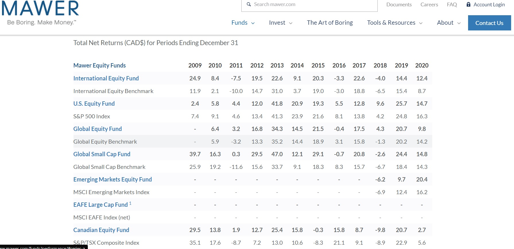
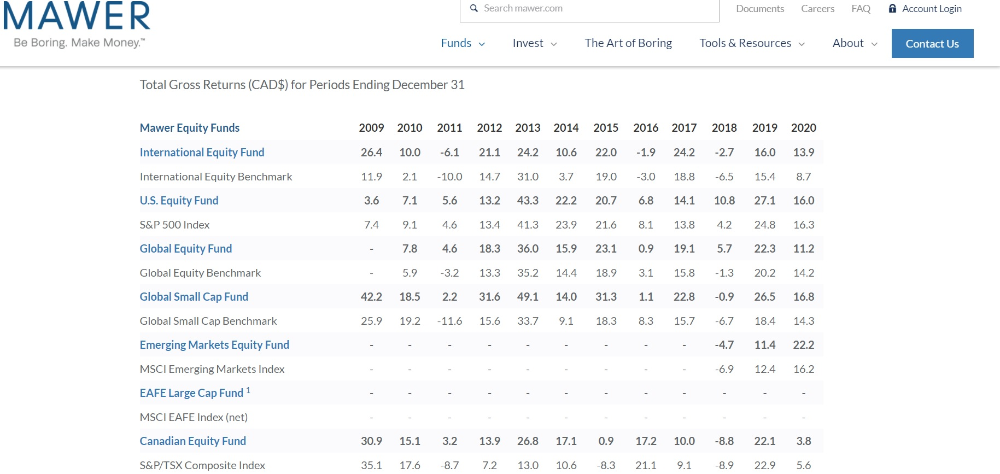

# MAWER 


## Overview and Origin

``` 
 Pronounced ‘More’ was founded in 1974 by Charles Mawer. Driven by his motto “Do the right thing” the company has used this as its core value when dealing with clients and chooses to stay independent. Being an investment firm the company is funded through its clients who pay management fees, commissions, and the money it manages for its clients with a total of 81.1 billion in assets for individual and corporations across all major asset classes.
 ```


## Business activities

``` 
Mawer provides long term investment solutions that allow their clients to “make money as they sleep”. With an emphasis on risk management and mitigating risk through diversification of their clients’ portfolio, Mawer takes a cautious approach to investing as opposed to an aggressive high risk approach. Navigating through their website they repeatedly mention a “bottom up approach”

     “Bottom-Up Investing is an investment approach that focuses on the     analysis of individual stocks and de-emphasizes the significance of macro-economic cycles and market cycles.” – Investopedia 

Mawer was started for investors that wanted to learn how to make better long term investments through educating and keeping their minds open. Not only offering investment management services they also have podcasts and articles available to everyone. Their target audience is broad in the sense that they aren’t targeting a specific age group but really anyone that wishes to begin investing without watching the markets on a daily or weekly basis. Mawer doesn’t follow fads or the next big thing, so if you’re looking for a get rich quick approach to investing this is not the place to go.

As any other traditional financial institution Mawer uses similar technology such as data analysis, wire transfers and other means of compiling and filtering data. They also allow for outside institutions to purchase their stocks except for RBC. Though they use these various types of technology they’re advantage is the ability to build and maintain the trust of their clients. Where the client doesn’t feel streamlined and it feels more personal due to the relationship being built between the client and investment manager.

Some of the programs they use to analyze data and access financial information are programs like FactSet, S&P Capital IQ, and Bloomberg. This allows them to make decisions quicker and better informed. 


```

## Landscape

``` 
Working predominantly in the Investment Management sector of the Finance domain, Mawer has remained competitive with other companies that offer the same product or more with a 99% client retention rate. In the last 5-10 years we’ve seen a rise in more Artificial Intelligence and Machine Learning software being used to improve efficiency and minimize human error while increasing speed and filling demand in the industry.  Other major players in this sector include Deloitte, BlackRock, The Vanguard Group, UBS Group, Fidelity, PIMCO to name a few.

```

## Results

``` 
With the COVID-19 pandemic and the overall uneasiness that people have felt Mawer has actually done well in every category of funds that they offer. When analyzing their quarterly reviews and annual total net return (Fig. 1.1),
```


```
  
 and total gross return (Fig. 1.2) they fared pretty well through the pandemic. Based on their first quarter reports and the increase in unemployment and government assistance the markets took a massive hit. Their stocks were not immune to this but in the second, third and fourth quarter they were able to stable out and in some cases come out on top.

```

 
```
In the second quarter they were still at a loss, to balance this out Mawer put an emphasis on internet and software based business, they implemented a premium on more stable businesses and reduced credit exposure to improve liquidity. 
In the 4th quarter of 2020 began disappointing, as the quarter continued there was a slow increase in yields and continues to look positive with the roll-out of vaccines and the economy opening up.
The core metrics used to indicate success were the phase of the market (bear or bull), what was happening in the world in relation to the rise and fall of various stocks and the relationship between monetary and fiscal authorities. Based on these indicators Mawer is on par with other companies similar to themselves. 
In comparison to another company in the same domain I chose to look into BlackRock and though I was not able to find their quarterly reports or any real comparison diagrams I was able to read their insights for 2021 and their reflection of 2020 as a whole. In their findings they reported similar numbers to Mawer. 


```
## Recommendations

``` 


```

[data](data)

[reference](reference)

[code](code)

[image](image)


